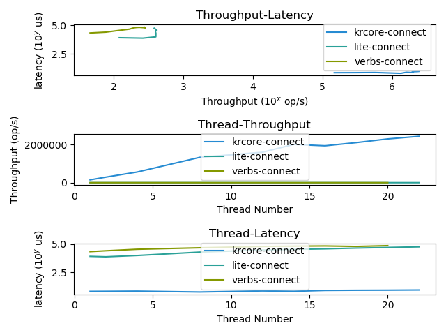
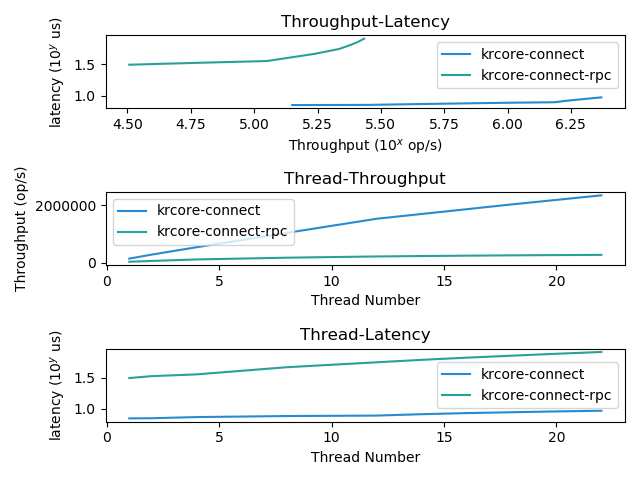
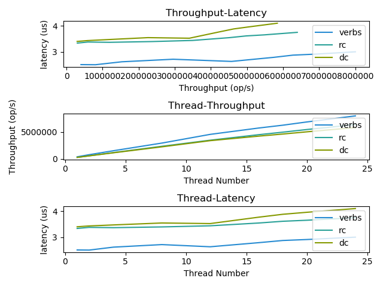
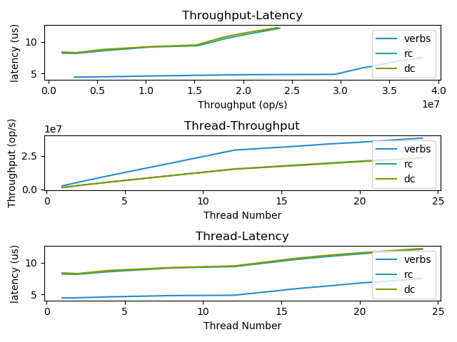
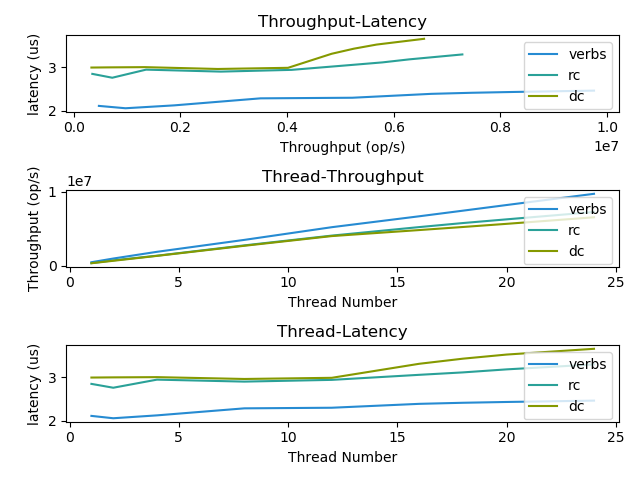
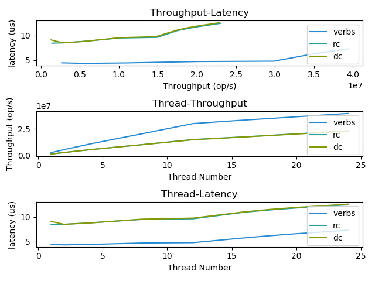
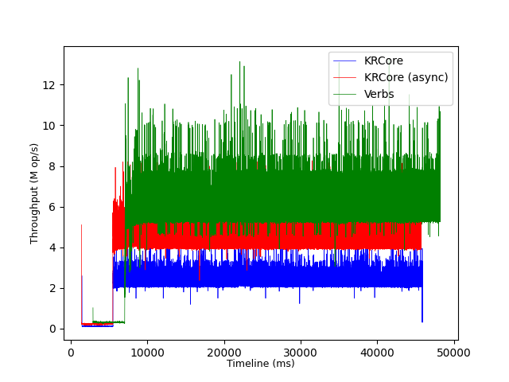

# Evaluation instructions of KRCore

**Important**. All the instructions of this README is executed at the **controller** (please refer to [README](../README.md)) for more details about the role of the controller. 

**Assumption**: the login user to clients and servers can execute `sudo` without entering the password. We only use `sudo` to install and remove KRCore kernel modules. 

## Overview

Our evaluations are fully automated by using `${PROJECT_PATH}/exp/makefile`. Note that the `make` only need to be executed on **one host** with KRCore's source code. 
[toc]

## Configurations

We assume you have done all of the enviroment configurations as described in [install.md](install.md) and can `insmod` the `KRdmaKitSyscall.ko` without any error message shown in `dmesg`.

First, enter  `${PROJECT_PATH}/exp_scripts`, and install necessary python packages: 

```sh
cd ${PROJECT_PATH}/exp_scripts
pip install -r requirements.txt
```

Then, youneed modify `makefile` under `${PROJECT_PATH}/exp_scripts` to make several options according to the hardware setups of your cluster. All of them is within the first 20 lines of the file (we list a sample configuration): 

```makefile
### configurations ###

USER=
PWD=
PROJECT_PATH=projects/krdmakit
SERVER_GID=fe80:0000:0000:0000:ec0d:9a03:0078:645e
SERVER_HOST=val14
CLIENT_HOSTS=val08 val09
STR_CLIENT_HOSTS='val08','val09'

USE_PROXY_COMMAND=false # true or false

## Plot related
PLOT=1 # If plot the target figure

### end of configurations ###
```

#### Descriptions of the variables setups: 

Variables below must be propery configured to reproduce the results: 

- `USER`: The login username of the all the hosts involved in the evaluations (should be the same)
- `PWD`: The login password of the above username. 
- `PROJECR_PARH`: Each hosts's directory path that containers the source code of KRCore.
- `SERVER_HOST`: One server is dedicated as the KRCore's server. 
- `SERVER_GID`: The gid of the RDMA NIC of  `SERVER_HOST` . Can use `ibstatus` to get it. 
- `CLIENT_HOSTS`:  Servers that act as clients in the evaluations. 
- `STR_CLIENT_HOSTS`: The string formation of the `CLIENT_HOSTS`. Each host should be wrapped by a pair of single quotes, and concatenate them. Do not add any blank into it.
  - e.g. `CLIENT_HOSTS='host1','host2','host3'`

Variables below is optional (can use the default value), if you encounter some problems, please refer to the setup of these. 

- `USE_PROXY_COMMAND`: If you use proxy command (e.g. in `.ssh/config` configuration), let it to be true. **False** as default.
- `PLOT`: Option for figure generating. 1 if do

Please kindly let us know if you have problem doing the configurations. 


## Run Experiments

#### Check if the configuration is correct (kick-the-tires)

We recommend you to configure one client and one server in the makfile at first. Make sure you have done the [install.md](install.md) environment preparations on these servers.

Suppose we have a sample makefile:

```makefile
### configurations ###
USER=
PWD=
PROJECT_PATH=my_project
SERVER_GID=fe80:0000:0000:0000:248a:0703:009c:7e00
SERVER_HOST=host1
CLIENT_HOSTS=host2
STR_CLIENT_HOSTS='host2'

USE_PROXY_COMMAND=false # true or false

## Plot related
PLOT_ONLY=0 # If only plot the target figure

### end of configurations ###
```

Then enter into `${PROJECT_PATH}/exp_scripts`, and you can use the following instructions to check whether the makefile and KRCore environments are properly set. 

```sh
cd ${PROJECT_PATH}/exp_scripts
make build-cpp     # build all of the user benchmark tools
make build-rc      # build as RC option
make build-dc      # build as DC option
make build-hybrid  # build as hybrid DCQP/RCQP option
```

If no error message shows, then it is ok and we are ready to go!  Note that  for `make uninstall` it may report an error. It is fine---meaning there is no existing KRCore modules installed)


#### Run experiment one-by-one

#### 1. Figure 8a 

Please run the experiments as follows: 

| Figure name | Commands                                                     | Expected runtime                                 |
| ----------- | ------------------------------------------------------------ | ------------------------------------------------ |
| Fig8a       | `make clean`<br/>`make verbs-connect`<br/>`make krcore-connect`<br/>`make lite-connect` | 1 mins <br />12 mins <br />12 mins <br />12 mins |

After running these experiemnts, you can use `make fig8a`  to plot the results, which will generate the outcome in `out/fig8a.png` (The first one corresponds to the one in the paper). 

The sample results using two machines (one for the server and one for the client) is shown below. The detailed logs can be found in `out/verbs-connect`, `out/krcore-connect` and `out/lite-connect`. 



---

#### 2. Figure 9a

Please run the experiments as follows: 

| Figure name | Commands                                                     | Expected runtime                   |
| ----------- | ------------------------------------------------------------ | ---------------------------------- |
| Fig9a       | `make clean`<br/>`make krcore-connect`<br/>`make krcore-connect-rpc` | 1 mins <br />12 mins <br />12 mins |

After running these experiemnts, you can use `make fig9a`  to plot the results, which will generate the outcome in `out/fig9a.png` (The first one corresponds to the one in the paper). 

The log files can also be found in the `out` directory. 



---

#### 3. Figure 10a

**Run the experiment**

| Figure name | Commands                                                     | Expected runtime                                 |
| ----------- | ------------------------------------------------------------ | ------------------------------------------------ |
| Fig10a      | `make clean`<br/>`make one-sided-verbs-sync-read.verbs`<br/>`make one-sided-krcore-sync-read.rc`<br/>`make one-sided-krcore-sync-read.dc` | 1 mins <br />12 mins <br />12 mins <br />12 mins |

**Get the result**: 

```
make fig10a
```

The log files can also be found in the `out` directory. 




---

#### 4. Figure 10b 

**Run the experiment: **

| Figure name | Commands                                                     | Expected runtime                                 |
| ----------- | ------------------------------------------------------------ | ------------------------------------------------ |
| Fig10b      | `make clean`<br/>`make one-sided-verbs-async-read.verbs`<br/>`make one-sided-krcore-sync-read.rc`<br/>`make one-sided-krcore-sync-read.dc` | 1 mins <br />12 mins <br />12 mins <br />12 mins |

**Get the result**: 

```
make fig10b
```

The log files can also be found in the `out` directory. 



---

#### 5. Figure 10c

**Run the experiment**

| Figure name | Commands                                                     | Expected runtime                                 |
| ----------- | ------------------------------------------------------------ | ------------------------------------------------ |
| Fig10c      | `make clean`<br/>`make one-sided-verbs-sync-write.verbs`<br/>`make one-sided-krcore-sync-write.rc`<br/>`make one-sided-krcore-sync-write.dc` | 1 mins <br />12 mins <br />12 mins <br />12 mins |

**Get the result**: 

```
make fig10c
```



The log files can also be found in the `out` directory. 

---

#### 6. Figure 10d

**Run the experiment**

| Figure name | Commands                                                     | Expected runtime                                 |
| ----------- | ------------------------------------------------------------ | ------------------------------------------------ |
| Fig10d      | `make clean`<br/>`make one-sided-verbs-async-write.verbs`<br/>`make one-sided-krcore-async-write.rc`<br/>`make one-sided-krcore-async-write.dc` | 1 mins <br />12 mins <br />12 mins <br />12 mins |

**Get the result**: 

```
make fig10d
```




The log files can also be found in the `out` directory. 

---

#### 7. Figure 11a

**Run the experiment**

| Figure name | Commands                                                     | Expected runtime                                 |
| ----------- | ------------------------------------------------------------ | ------------------------------------------------ |
| Fig11a      | `make clean`<br/>`make two-sided-verbs-sync.verbs`<br/>`make two-sided-rc-sync.rc`<br/>`make two-sided-dc-sync.dc` | 1 mins <br />12 mins <br />12 mins <br />12 mins |

**Get the result**: 

```
make fig11a
```


Note that some points maybe slow due to viberation, can re-evaluate several times to get a steady performance. 

The log files can also be found in the `out` directory. 

---

#### 8. Figure 11b

**Run the experiment**

| Figure name | Commands                                                     | Expected runtime                                 |
| ----------- | ------------------------------------------------------------ | ------------------------------------------------ |
| Fig11b      | `make clean`<br/>`make two-sided-verbs-async.verbs`<br/>`make two-sided-rc-async.rc`<br/>`make two-sided-dc-async.dc` | 1 mins <br />12 mins <br />12 mins <br />12 mins |

**Get the result**: 

```
make fig11b
```


The log files can also be found in the `out` directory. 

---

#### 9. Figure 14 

**Run the experiment**

| Figure name | Commands                                                     | Expected runtime                              |
| ----------- | ------------------------------------------------------------ | --------------------------------------------- |
| Fig14       | `make clean`<br/>`make race-hashing-verbs PLOT=0`<br/>`make race-hashing-krcore PLOT=0`<br/>`make race-hashing-krcore-async PLOT=0` | 1 mins <br />2 mins <br />2 mins <br />2 mins |

**Get the result**: 

```
make fig14
```



The log files can also be found in the `out` directory. 

---

## Evaluation cleanup

To cleanup all of the kernel modules (i.e. `rmmod`), just use:

```sh
make clean
```


## Extra Attention 

- Sometimes the kernel may panic. It will occur if the configuration is not correct. Reboot is need when encounter the kernel panic.
- Your workspace should be under **`${PROJECT_PATH}/exp_scripts`.**
- You'd better backup the `makefile` (i.e. `cp makefile makefile.bk`) before starting and then change the configurations carefully, according to your clusters (see explainations in [variables](#variables).
- Sometimes you may find the log has `inf`  latency/throughput , it means the running duration is not long engough. Just increase the `run_sec_s` and `run_sec_c` in the `makefile`
- All of the tests' logs have been recorded into `${PROJECT_PATH}/exp_scripts/out/<test-name>/run-%d.toml.log`. You may find them helpful if the data is abnormal.

And if you have any questions, please contact us. 

